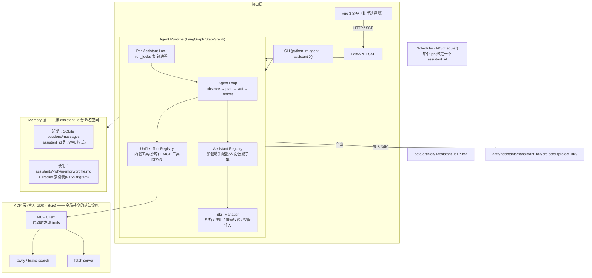
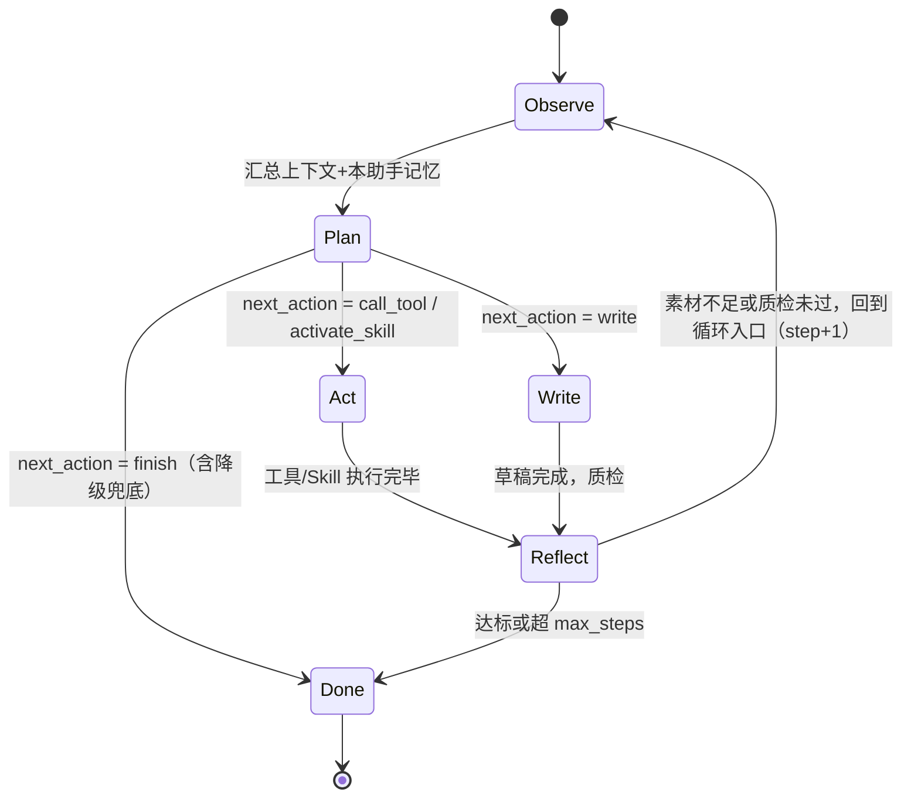
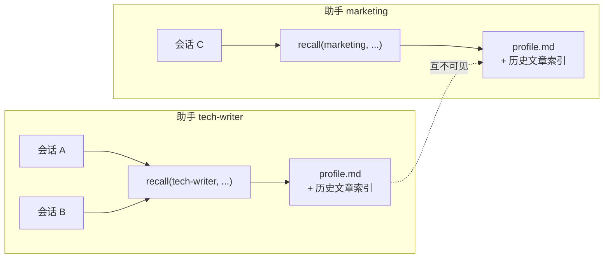
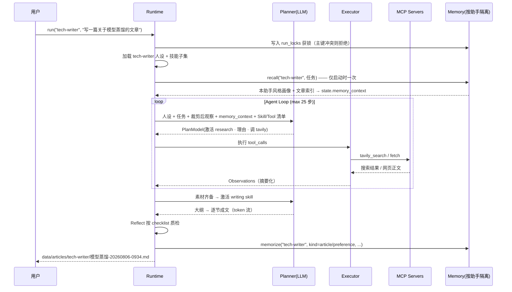

# 个人写作 Agent — 阶段 1：架构设计文档

> 版本：v1.20 · 2026-08-16
> 状态：阶段 4 写作 IDE、v1.11 复审加固、v1.13 项目 Agent 流式编辑、v1.14 空白文档生成修复、v1.15 项目 Agent 多会话历史、v1.16 失败路径加固、v1.17 活动流跨事件滑窗、内联 diff 审阅与上下文压缩、v1.18 SSE 断线游标续传、v1.19 项目聊天持久化工作记录及 v1.20 多 hunk change set 与逐 hunk 审查均已完成
> v1.1 变更：新增「Assistant（助手）」一等概念——多助手、助手间记忆隔离、同助手跨会话记忆共享（见第 4 节）
> v1.2 变更：根据《阶段 1 架构文档审查报告》修复全部 4 个 P0、6 个 P1、12 个 P2 问题。主要改动：Planner 降级路径可路由化（§5.1/§9）、状态图与路由描述对齐（§3）、文章 API 隔离红线收紧（§5.9）、新增同助手并发控制（§4.6）、内置文件工具沙箱化并移除默认 filesystem MCP（§5.6）、Skill 依赖缺失边界（§5.5）、上下文裁剪策略（§3.3）、Reflect 质检清单（§3.4）、助手删除语义（§4.2）、中文检索定案 FTS5 trigram（§5.7）、tests 纳入 MVP（§8/§10）及一批 P2 措辞修正。
> v1.3 变更：根据复审意见修复 R1–R5——运行锁改为 app.db 内 `run_locks` 表实现**跨进程互斥**并定义崩溃残留回收（§4.6）；补 `sources` 表定义（含 `assistant_id` 列，§5.7）；trigram 不足 3 字查询回退 LIKE（§5.7）；统一工具协议增加隐式 `ToolContext` 注入 `assistant_id`（§5.2）；`AgentState` 补 `reflect_fails` 计数字段（§3.1）；删除助手前检查运行锁（§4.2）。
> v1.4 变更：与阶段 2 代码审查修复同步——**Reflect 回边由"回 Plan"改为"回 Observe"**（§3 状态图与路由描述），保证每轮循环经过计数节点、max_steps 真正生效；运行锁占位原子化（INSERT OR IGNORE）+ 释放带 task_id 所有权（§4.6）；成文素材改由 `sources` 表回读注入（§5.7）；`AgentState` 移除死字段 `sources`。其余代码层修复详见《阶段 2 代码审查报告》处理结果。
> v1.5 变更：明确阶段 3 实施约定——`messages` / `articles` 使用 FTS5 trigram 外部内容索引、触发器同步与存量数据回填，不足 3 字查询回退 LIKE（§5.7）；Runtime 持有 `AsyncIOScheduler`，只在 `python -m agent schedule` 长驻模式启用，与 Runtime 共用当前 asyncio 事件循环，普通 `run` 仍是一次性执行（§5.4/§5.8）。
> v1.6 变更：与阶段 3 代码审查修复同步——短词元查询按词元降级为转义后的参数化 LIKE，长查询在全体候选词元中均匀采样；profile 或 SQLite 任一路 recall 失败仅 warning 并独立降级，不阻断写作任务（§5.7/§9）；内置 JOB 改绑自动创建的 `default` 助手并明确 60 秒 misfire 规则（§5.8）；CLI 将 Runtime 启动纳入清理边界，启动或运行异常均关闭已分配资源（§5.4/§9）。
> v1.7 变更：根据阶段 3 第二轮复审 R1 收紧 LIKE 降级查询——模式数量与 FTS 查询一致最多 16 个，超限时在全部短词元中均匀采样并保留首尾，避免极端短词任务生成无上限 OR LIKE 全表扫描（§5.7）。
> v1.8 变更：阶段 4 改为“文档优先”的写作工作台；增加可继续编辑的文章草稿、单调递增文档版本和选区局部改写建议。局部改写必须复用 AgentRuntime/助手隔离/运行锁，先生成预览再显式应用，并以 `assistant_id`、`article_id` 与 `document_version` 做归属和乐观并发校验（§4.7/§5.7/§5.9/§5.10）。
> v1.9 变更：阶段 4 的文档模型扩展为“一助手多文章项目”。一个项目对应助手受管目录下的一个文件夹；导入文件夹时完整复制目录树，导入 `.md`/`.markdown`/`.txt` 时自动创建同名项目文件夹。Web UI 采用 VS Code 式项目资源管理器、多标签编辑器与右侧 Agent 面板；选区改写和聊天修改统一生成可审阅 change set，确认后才写入项目文件（§4.7/§5.7/§5.9/§5.10）。
> v1.10 变更：根据阶段 4 代码审查收紧写作 IDE 契约——文档保存与 change set 应用采用跨进程串行、可恢复的写入意图，冲突请求不得触碰正文文件；一次聊天产生的多个 change set 必须先全量校验再原子落库；任务记录携带 `assistant_id`、SSE 按订阅者广播且终态记录有界保留；内置写工具禁止覆盖受管项目；前端预览必须消毒，所有保存/应用操作以标签页或 change set 自身 `project_id` 为准，并保护 dirty 内容、同步 CodeMirror 与关闭 SSE（§4.7/§5.7/§5.9/§5.10/§6.2）。
>
> v1.11 变更：根据阶段 4 复审补齐恢复与异步作用域契约——运行锁和文档写入意图记录 PID 对应的进程启动时间，遗留旧行以创建时间 TTL 兜底，PID 复用不得造成永久阻塞；写入意图先用短事务认领、在事务外原子写文件、再用短事务终结，认领/插入竞态稳定映射 HTTP 409；MemoryStore 启动时对账 `.import-*`、`.purge-*` 与归档半程残骸，约束表迁移必须原子回滚；导入文件的 UTF-8 BOM 在后续保存/apply/恢复中保持；资源冲突使用专用异常；所有异步任务端点在返回 202 前校验助手与运行锁；前端的助手切换、项目树、文档打开、rewrite、apply/reject 和 SSE 只接纳发起作用域仍匹配的异步响应，待审卡片仅在父级确认 apply/reject 成功后移除（§4.7/§5.7/§5.9/§5.10/§6.2/§9）。
> v1.12 变更：文档目录按 `architecture/`、`reviews/`、`guides/` 与 `history/` 分类，并新增 `docs/README.md` 导航；仅调整文档位置与入口链接，不改变运行时架构或模块契约。
> v1.13 变更：项目 Agent 聊天改为有界的流式工具调用：普通回答直接发送文本增量；编辑指令调用项目作用域的 `propose_project_edits` 工具，以精确旧文本/新文本和文档版本批量创建 pending change set，再发送 `change_preview`，正文仍只在用户接受后写入。前端把同一任务的文本增量追加到一个消息气泡，并展示工具执行状态和既有 diff 审核卡片（§4.7/§5.2/§5.4/§5.9/§5.10/§6.2/§9）。

> v1.14 变更：`propose_project_edits` 允许仅在目标文档正文为空时使用 `old_text=""`，语义固定为在 `[0, 0)` 插入新正文，从而让项目 Agent 能为新建空白项目生成首稿；非空文档仍禁止空旧文本，避免插入位置歧义。项目 Agent 失败时前端只显示一条可读错误，不重复呈现工具错误与任务错误（§4.7/§5.4/§6.2/§9）。

> v1.15 变更：每个助手的每个项目支持多个持久化 Agent 聊天会话；专用 `project_chat_sessions/project_chat_messages` 表按助手、项目、会话三层隔离，恢复最近会话、完整消息与关联 pending diff。模型每轮接收当前会话全部可见历史；上下文压缩列入后续待办，本版不截断。会话存在 pending diff 或助手任务运行中时禁止删除；chat diff 只在 AgentPanel 呈现，接受/拒绝成功后按服务端状态移除。会话加载期间禁止发送，失败流不保留未持久化的半截 assistant 文本，重新生成作为新的可见 user 消息呈现，避免 UI 与模型历史分叉（§4.7/§5.4/§5.7/§5.9/§5.10/§9）。

> v1.16 变更：根据阶段 5 审查加固项目聊天失败路径。首次发送由 API 预建会话后，任务若在首条消息持久化前失败或取消，只补偿删除仍为 0 消息且无关联 diff 的新会话；已有消息或 diff 时必须保留，补偿异常不得覆盖原始任务错误。聊天消息与普通任务统一限制为 100,000 字符；流式工具参数通过 schema 校验后才发送 `tool_call`；异常退出显式关闭模型流；空白模型回复转为可见且持久化的提示。前端 POST 失败回滚未送达 user 气泡，终态清理工具状态，token 到达时自动滚动，SSE 断线提示刷新恢复（§5.4/§5.7/§5.9/§5.10/§9）。

> v1.17 变更：三项修正与两项能力扩展。**（1）活动 SSE 流按单调递增序号跨越事件滑窗**：`TaskBroker` 的事件历史是有界滑窗，活动订阅者必须用任务内 `seq` 而非列表下标定位，窗口裁剪不得让活动订阅者停止收流或漏发终态；网络断线后的游标续传不属于本版完成范围，列入待办（§5.9/§6.2/§9）。**（2）待确认 change set 采用编辑器内联 + 侧栏卡片双视图**：同一 change set 在 CodeMirror 中以原文删除态、建议新增态和内联接受/拒绝控件呈现，同时在 Agent 面板保留可审阅卡片；两个视图共享 App 层的单一 pending 集合与单一 apply/reject 通道，禁止各自持有状态或重复发起请求（§5.10）。**（3）选区工具栏必须可输入**：浮层不得对输入控件调用 `preventDefault`，挂载后显式聚焦，并在编辑器失焦期间用装饰保持选区可见（§5.10）。**（4）项目聊天上下文分层压缩**：按 token 预算保留最近若干条消息全文，更早历史用一次 LLM 调用压缩为摘要并持久化到 `project_chat_summaries` 复用；注入的当前文档正文超限时按窗口截断并显式标注省略（§3.3/§5.4/§5.7）。**（5）助手管理进入前端**：助手选择器旁提供创建与归档删除入口，复用既有 `POST/DELETE /api/assistants`（§5.10）。

> v1.18 变更：补齐 SSE 断线游标续传（v1.17 遗留待办）。每个 SSE 数据帧携带标准 `id: <seq>` 行；`GET /api/tasks/{id}/stream` 接受显式 `after_seq` 参数或标准 `Last-Event-ID` 请求头恢复游标，参数优先，非法头按全新订阅处理。游标仍被重放窗口覆盖时从游标之后精确补发，不重复不遗漏；游标落后于窗口时先发送一条不带 `seq` 的 `reconnect_gap` 控制事件再继续活动流，终态事件始终送达；超出已记录范围的未来游标回拨重发末尾事件，避免空流。前端 `watchTask` 返回可恢复订阅句柄：网络错误按退避（0.5s 起步、8s 封顶、最多 6 次）携带游标重连并按 `seq` 去重，仅在终态、作用域切换或重连耗尽时关闭；收到 `reconnect_gap` 后丢弃非终态事件并移除半截回复，Agent 面板在任务终态后重载持久化会话以恢复完整回复与漏发的 pending diff，选区改写在编辑器保留可重试提示（§5.9/§5.10/§6.2/§9）。同版附带 fetch MCP server 部署方式调整：改由项目 Python 环境直跑（§5.6）。

> v1.19 变更：实现项目 Agent 聊天的持久化工作记录。新增 `project_chat_work_events` 表（按助手、项目、会话三层隔离，`(task_id, event_seq)` 唯一、`kind=task` 终态按 `(assistant_id, project_id, task_id)` 唯一部分索引幂等）；Runtime 在项目聊天全程发射 `work_item_start` / `work_item_delta` / `work_item_done` SSE 事件，`delta` 只走流不落库，明细事件仅在 `done` 时落库且单任务上限 199 条、第 200 条固定为溢出摘要（按被省略事件的类型合并计数）、任务终态不受限；工具参数摘要 4,000 字符、结果 8,000 字符（前 6,000 + 后 2,000）截断并递归脱敏敏感字段；任务失败/取消时运行中工作项统一以 `interrupted` 终结落库，终态落库自身失败只记 warning、不得掩盖原始任务错误；会话详情接口返回工作记录并按 TaskBroker 活动状态与助手运行锁对账补写 `interrupted` 终态（无 broker 作用域的直连任务以运行锁 task_id 标识，锁未释放视为仍在运行）；前端在用户消息与最终回复之间渲染工作记录：运行中默认展开、终态自动折叠（标题含耗时、工具数、建议数、状态）、历史默认折叠可展开、无终态组显示为运行中、`changes` 项可定位文档；工作记录与聊天消息、模型上下文和上下文摘要完全隔离，不进 FTS、长期记忆与 prompt（§5.4/§5.7/§5.9/§5.10/§6.2/§9）。

> v1.20 变更：change set 拆分为"hunk 容器"模型，编辑器审查对齐 TRAE。`change_sets` 改存父级信息（含 `task_id`，`(task_id, document_id)` 唯一），修改片段落`change_set_hunks`（code point 半开区间、`display_order`、hunk 级状态），历史单范围记录单事务迁移为"父级 + 单 hunk"并生成 `legacy-<id>` 合成任务 id。`propose_project_edits` 输入改为按文档分组的`hunks` 列表（拒绝模型提供 offset），一次调用可对同一文档提交多处修改——修复"同一次编辑调用中每个文档只能出现一次"的已知缺陷；服务端原子完成定位、快照、排序、不重叠与容量校验（≤100 hunk、≤1 MiB），创建即冻结。审查交互为逐 hunk 独立接受/放弃：接受单个 hunk 是唯一应用原语（三段式写入、版本 +1），同组其余 hunk 以 `old_text` 内容复检保持可审，其他任务建议整组 stale；API 提供 hunk 级 accept/reject、整组 accept-all 与按文档分页的 change set 查询，稳定错误码区分 stale/already_applied/already_rejected/conflict，保存与应用响应携带 `staled_change_set_ids`；前端内联 diff 一次渲染全部 hunk、每个 hunk 自带独立接受/放弃按钮，侧栏保留批量入口并按 hunk 摘要展示（§4.7/§5.2/§5.7/§5.9/§5.10/§6.2/§9）。

---

## 0. 设计假设

| # | 假设 | 影响 |
|---|------|------|
| A1 | 单用户、本地运行，无鉴权 | FastAPI 只绑 `127.0.0.1`；SQLite 单文件 |
| A2 | LLM 走 OpenAI 兼容接口，默认 DeepSeek | 一套 client 代码，`base_url` 切换服务商 |
| A3 | 搜索首选 Tavily MCP Server，Brave 备选 | `mcp_servers.json` 配置切换，代码无关 |
| A4 | 中文写作为主，长文分段生成 | 大纲→逐节成文→合并，避免单次输出截断 |
| A5 | LangChain 系只引入 `langgraph` + `langchain-core` + `langgraph-checkpoint-sqlite`（含 aiosqlite），不引入全家桶其余部分 | 依赖轻，工具抽象层自己控制 |
| A6 | **多助手 ≠ 多用户**：所有助手同属一个用户，隔离只为上下文纯净，不做权限 | 隔离靠命名空间约定（`assistant_id` 贯穿所有表和目录），无鉴权层 |

---

## 1. 核心设计决策（先看结论）

| 决策 | 结论 | 一句话理由 |
|------|------|-----------|
| Agent vs Workflow | **Planner 每轮动态决策**，而非固定 DAG | 满足"根据任务动态决定调用哪些 Skill/Tool"的核心判定标准 |
| Agent Loop 实现 | LangGraph `StateGraph` + 条件边 | 状态机显式建模"观察→规划→执行→反思"循环，自带流式事件与 checkpoint |
| Planner 输出 | **强类型 Pydantic 模型**（子任务 + 工具/Skill 选择 + 选择理由）；**降级兜底也必须可路由**（强制 finish 或 failed） | 理由可观测；兜底不产生无法驱动状态机的中间态 |
| 工具协议 | 统一 `ToolSpec` 抽象，内置工具与 MCP 工具**同一张表**；内置文件工具**沙箱限制在 `data/` 内** | Agent 核心对工具来源无感知；文件写入不越界 |
| Skill 机制 | 对齐 Claude Code：`SKILL.md`（YAML frontmatter + 正文 prompt），**渐进式披露**；激活前校验依赖工具可用性 | 规划时只注入元数据（省 token）；依赖缺失时激活失败可见、可决策 |
| MCP | 官方 `mcp` Python SDK，stdio 传输，配置文件注册 | 严格遵循官方规范，不自造协议 |
| **多助手与记忆隔离** | **Assistant 为一等概念，`assistant_id` 是所有持久化数据的命名空间** | 助手间零共享（记忆/文章/会话），同助手跨会话全共享 |
| **并发控制** | **同一 `assistant_id` 同时只允许一个运行中任务**，后来者拒绝（API 409 / CLI 报错）；锁落 app.db 的 `run_locks` 表，**跨进程有效** | CLI/FastAPI/多 CLI 窗口是多进程，内存锁互不可见；INSERT 即获锁 + 过期回收，成本与内存锁相当 |
| 记忆 | SQLite（会话/消息/文章索引）+ Markdown（长期画像），**均按助手分命名空间**；**中文检索定案 FTS5 trigram** | 文件可读可改，DB 可查可索引；trigram 对中文子串匹配有效 |
| 流式 | LangGraph `astream_events` → 事件总线 → SSE | 思考过程、工具调用、正文 token 三类事件统一推送 |
| **文档优先交互** | **文章项目/文件是 Web 主对象，聊天是对当前项目的 Agent 操作入口** | 让 Agent 服务写作产物，而不是复刻通用角色聊天界面 |
| **选区局部改写** | 选中文本 → 指令 → AI 建议 → diff 预览 → 用户确认应用 | 只改变用户明确选中的范围，避免整篇文章被意外覆盖 |

---

## 2. 总体架构



**分层原则**：接口层不含业务逻辑；Runtime 不知道工具来自 MCP 还是内置；MCP 层不知道 Skill 存在；Memory 对 Planner 只暴露两个方法（`recall` / `memorize`），且**所有调用必须携带 `assistant_id`**。

**共享 vs 隔离的边界**（重要）：

| 共享（全局基础设施，非记忆） | 隔离（每助手独立命名空间） |
|------|------|
| MCP 工具连接、Skill 目录（能力本身）、LLM client、Scheduler 进程 | 长期画像 profile.md、文章索引、会话/消息历史、文章输出目录、文章项目目录、运行锁 |

---

## 3. Agent Loop 状态机（核心）



> 路由规则（图文一致）：**条件边挂在 Plan 与 Reflect 两个节点之后**。Plan 之后按 `state.plan.next_action` 四路分发（Act/Write/Done；`activate_skill` 走 Act 边完成注入）；Reflect 之后按质检结果二路分发（回 Observe 或 Done）。
>
> **为什么回边指向 Observe 而非 Plan**（v1.4 修正）：`step` 只在 Observe 递增，若 Reflect 直接回 Plan，计数器整个任务生命周期只执行一次，`max_steps` 防死循环与 Planner 进度提示会整体失效——这是阶段 2 代码审查发现的 P0 级缺陷，回边必须让每轮循环都经过计数节点。

### 3.1 状态定义（AgentState）

LangGraph 的 State 用 `TypedDict`，全链路单一数据源：

```python
class AgentState(TypedDict, total=False):
    assistant_id: str              # ★ 当前助手，整个 Loop 不可变
    task: str                      # 用户原始目标
    session_id: str                # CLI 每次运行生成 uuid4；--resume <session_id> 从 checkpoint 续接
    memory_context: str            # 任务启动时 recall 一次的结果，Planner 每轮从此注入
    messages: list[BaseMessage]    # 对话/工具消息（add_messages reducer；裁剪策略见 §3.3）
    plan: PlanModel | None         # Planner 当前计划（Pydantic）
    active_skills: list[str]       # 已激活的 Skill 名
    observations: list[Observation]# 工具执行结果的结构化摘要（非原始全文）
    draft: str                     # 当前草稿（Markdown）
    step: int                      # 已用步数（防死循环）
    reflect_fails: int             # 连续质检未过次数（≥3 强制 finish，见 §3.4）
    status: str                    # running / done / failed
    output_path: str | None        # 最终文件路径
```

### 3.2 与"固定 Workflow"的本质区别

- **路由由 Planner 节点决定**：条件边读取 `state.plan.next_action`（`call_tool` / `activate_skill` / `write` / `finish`），而不是写死 research→write 的顺序。
- **Skill 选择发生在运行时**：Planner 每轮都能看到 Skill 元数据清单，简单任务（如"润色这段文字"）可以跳过 research 直接激活 editing。
- **循环可回退**：Reflect 节点判定素材不足时，可以带着新查询词回到 Plan，再次调用搜索——固定 DAG 做不到这一点。
- **max_steps 兜底**：默认 25 步，超限强制收敛到"基于已有素材成文"，防止 token 燃烧。

### 3.3 上下文裁剪策略（防 token 爆炸）

`max_steps` 只防死循环，不防上下文膨胀。裁剪规则：

1. **工具原始输出不进 `messages`**：Executor 把原始结果压缩为 `Observation`（成功：`summary` ≤500 字 + 关键字段；失败：`error` 信息），只有 Observation 进入对话历史。fetch 的网页全文截断至 2000 字符后进 Observation，全文落 SQLite `sources` 表备查。
2. **观察滑窗**：Planner 每轮只看最近 8 条 Observation 全文；更早的压缩为一行索引（`[3] tavily_search("模型蒸馏") → 5 条结果`）。
3. **强制压缩**：估算 prompt token 超阈值（默认 60k，可配）时，用一次 LLM 调用把滑窗外的观察总结成一段，替换原始条目。
4. **正文不进循环上下文**：分段写作时，已完成的章节存 `state.draft` / 文件，下一节只带大纲和本章要点，不带全文。

**项目聊天的分层压缩（v1.17）**：项目 Agent 面板不走 Agent Loop，但同样受上下文预算约束，规则独立定义如下。

- **token 估算不引入外部分词依赖**：按字符类型估算——CJK 字符约 1 token/字，其余按约 4 字符/token 折算，另计每条消息的固定开销。估算只用于是否触发压缩的判定，不要求与服务端计费口径一致。
- **保留窗口**：最近 `CHAT_CONTEXT_KEEP_RECENT` 条可见消息永远全文进入 prompt，保证最近几轮指令不失真。
- **摘要复用**：窗口之外的历史压缩成一段中文摘要，连同"已覆盖到哪条 `message_id`"持久化。下一次只把"上次摘要 + 新滑出窗口的消息"交给模型再压缩一次，不重复压缩全量历史。摘要以独立的 `system` 消息注入，并显式标注这是早期对话摘要。
- **压缩失败不阻断对话**：压缩调用异常时记 warning 并降级为直接丢弃最早消息，任务继续；不得因为压缩失败让用户的这一轮聊天失败。
- **文档正文窗口**：注入 system prompt 的当前文档正文超过 `CHAT_CONTEXT_DOC_MAX_CHARS` 时，保留首尾片段并在中间插入显式省略标记，说明正文已截断、需要完整内容时应向用户确认；截断只影响 prompt，不影响 `propose_project_edits` 的服务端精确匹配。
- **预算与开关可配**：`CHAT_CONTEXT_TOKEN_BUDGET`、`CHAT_CONTEXT_KEEP_RECENT`、`CHAT_CONTEXT_DOC_MAX_CHARS` 从 `.env` 读取；预算设为 0 表示关闭压缩，恢复 v1.15 的全量历史行为。

### 3.4 Reflect 质检清单（防自由心证）

Reflect 节点的 prompt 内置明确 checklist，逐项判定后才允许 `done`：

- 引用来源 ≥3 且每条可追溯（URL + 抓取时间）
- 大纲每个章节均有素材覆盖，无空节
- 正文包含来源标注
- 字数达到任务要求下限
- 关键数字/人名/日期已在来源中出现（不臆造）

任一项不过 → 回 Plan 并携带缺失项说明；连续 3 次质检未过 → 强制 finish 并在文末标注存疑项。

---

## 4. Assistant 模型与记忆隔离

### 4.1 什么是 Assistant

Assistant = **有独立身份、人设提示词、技能子集和独立记忆空间的写作助手实例**。例如「科技作者」擅长深度技术长文、「营销文案」偏好短平快风格——两者各写各的，互不污染对方的风格记忆。

### 4.2 助手定义（文件即配置）

```
data/assistants/
  tech-writer/
    assistant.yaml     # 助手定义
    persona.md         # 人设/系统提示词（可选，内容注入 system prompt）
    memory/profile.md  # 长期记忆（Agent 自维护，人可手改）
  marketing/
    ...
  default/             # 内置兜底助手，CLI 不指定 --assistant 时使用
```

`assistant.yaml`：

```yaml
id: tech-writer
name: 科技作者
description: 深度技术文章写作，注重引用来源与逻辑严密
skills: [research, writing, editing]   # 可裁剪的技能子集；缺省 = 全部
persona_file: persona.md               # 可选
created_at: "2026-08-05"
```

**为什么是文件而不是数据库**：助手定义是"配置"不是"状态"，人应该能用记事本直接增删改——符合白盒原则。运行时由 `AssistantRegistry` 扫描 `data/assistants/` 加载，新增文件夹即新增助手，无需重启之外的操作。

**删除语义（默认归档，非抹除）**：
- **删除前置检查**：先查 `run_locks` 表（§4.6）——该助手有运行中任务时**拒绝删除**并提示"任务运行中，请先等待完成"（Windows 上移动被进程占用文件的目录会直接失败，必须先挡）。
- 删除助手（CLI `assistants delete <id>` / API `DELETE`）：整个目录移动到 `data/archive/<id>-<时间戳>/`；SQLite 中该助手的 `sessions` / `messages` / `articles` 行**保留**，但因助手未注册而查询不到（等同不可见）。
- 只有显式加 `--purge` 才级联删除 SQL 行与归档目录。
- 恢复 = 把目录从 archive 移回 `data/assistants/`，SQL 数据自动重新可见。

### 4.3 隔离规则（核心）

| 数据 | 载体 | 命名空间方式 | 同助手跨会话 | 跨助手 |
|------|------|------------|:---:|:---:|
| 长期画像（风格/偏好/常用主题） | `assistants/<id>/memory/profile.md` | 目录隔离 | ✅ 共享 | ❌ 物理隔离 |
| 会话与消息 | SQLite `sessions` / `messages` 表 | `assistant_id` 列，**所有查询强制 WHERE** | ✅ 可检索历史会话 | ❌ 查询不到 |
| 文章索引 | SQLite `articles` 表 | `assistant_id` 列 | ✅ 共享 | ❌ |
| 文章文件 | `data/articles/<assistant_id>/` | 目录隔离 | ✅ | ❌ |
| 文章项目 | `data/assistants/<id>/projects/<project_id>/` + SQLite 项目/文件元数据 | 助手目录物理隔离 + `assistant_id` 强制过滤 | ✅ | ❌ |
| Agent Loop checkpoint | SQLite | `thread_id = <assistant_id>:<session_id>` | — | ❌ |
| MCP 工具 / Skill 目录 / LLM client | 进程级 | 不隔离（是能力不是记忆） | ✅ | ✅ |

**强制手段**：`memory/store.py` 的接口签名把 `assistant_id` 作为**第一个必填位置参数**（`recall(assistant_id, query)` / `memorize(assistant_id, ...)`），从类型层面杜绝"忘了过滤"的串记忆事故；SQL 全部走 store 层，业务代码禁止裸写 SQL。

### 4.4 记忆隔离数据流



- 同助手：会话 B 开始时，`recall` 能拿到会话 A 沉淀的偏好与文章索引——**"第二次写同主题文章能引用偏好"由此保证**。
- 跨助手：marketing 的 `recall` 物理上够不到 tech-writer 的 profile（不同文件）和索引（SQL 强制过滤）。

### 4.5 对既有模块的影响

| 模块 | 变更 |
|------|------|
| Runtime | `run(assistant_id, task)`；启动时 `AssistantRegistry` 加载全部助手，运行时按 id 取人设/技能子集组装 system prompt；**按助手粒度加运行锁（§4.6）** |
| Planner | 注入的记忆摘要 = `state.memory_context`（启动时 `recall(assistant_id, task)` 一次）；看到的 Skill 清单 = 助手技能子集 ∩ 全局 skills 目录 |
| Scheduler | `config` 中每个 job 声明 `assistant_id`，触发时以该助手身份跑完整 Loop；若该助手正忙则跳过本次并记日志 |
| API | `GET/POST /api/assistants`、`DELETE /api/assistants/{id}`（默认归档）；`POST /api/tasks` 必带 `assistant_id`；`/api/articles` 的 `assistant_id` **必填** |
| CLI | `python -m agent --assistant tech-writer "写一篇..."`，缺省用 `default`；`--resume <session_id>` 续接会话 |

### 4.6 并发控制（同一助手任务串行）

Scheduler、CLI、API 三个入口都可能让同一个助手同时跑两个 Loop，会引发 profile.md 写竞争与文章文件冲突。**注意 CLI 与 FastAPI 是独立进程、多开 CLI 窗口也是多进程，进程内内存锁互不可见，因此锁必须跨进程。** 策略：

- **锁落数据库**：app.db 内置 `run_locks` 表（`assistant_id` 主键 + `task_id` + `pid` + `acquired_at`）。获锁 = `INSERT` 成功（主键冲突即被占）；释放 = 任务结束 `DELETE` 该行。SQLite 单文件 + WAL 下 INSERT 主键互斥**天然跨进程**，CLI、FastAPI、多个 CLI 窗口看到的是同一把锁。
- **崩溃残留回收（TTL + PID 存活校验双保险）**：获锁前先处理过期行——`acquired_at` 距今超过 `RUN_LOCK_TTL`（默认 2 小时，覆盖长文任务合理时长）的锁行进入回收流程，但**回收前先用 `pid` 列做存活校验**（Windows 上 `OpenProcess` / POSIX 上 `os.kill(pid, 0)`）：进程已死 → 确认是强杀残留，删行后重试插入；进程仍存活 → 说明任务还在跑只是超时，**不回收**，按"被占用"走拒绝路径并提示该任务已超时应人工检查。进程正常退出总会删行，走到回收流程的只剩崩溃/强杀场景。
- **后来者拒绝，不排队**（个人工具场景下"拒绝"比静默排队更可预期）：API 返回 `409 Conflict` + 当前运行中的 `task_id`；CLI 直接报错退出并提示；Scheduler 跳过本次触发并记 warning。
- 进程内可保留一层 `asyncio.Lock` 作为快路径（避免同进程并发协程频繁打 DB 主键冲突），但**正确性由 `run_locks` 表保证**，内存锁只是优化。

### 4.7 文章项目、受管文件与 AI 修改

阶段 4 的 Web 主对象是**文章项目**，不是聊天会话。一个助手可以拥有多个项目；一个项目对应 `data/assistants/<assistant_id>/projects/<project_id>/` 下的一个受管文件夹，可包含正文、章节、素材和图片。项目内 `.md`、`.markdown`、`.txt` 是可编辑文档，其他普通文件可显示在资源树中但本阶段不承诺文本编辑。

导入一律采用“复制到受管目录”语义，不保留外部路径引用或双向同步：

- 导入文件夹：创建一个项目并递归复制目录树，保留合法相对路径；一个导入文件夹就是一个文章项目。
- 导入单个 `.md`、`.markdown` 或 `.txt`：按源文件名创建项目文件夹，再把原文件复制进去并作为首次打开文档。
- 同名项目使用稳定 `project_id` 与显示名分离，不覆盖已有目录；拒绝绝对路径、`..`、符号链接/重解析点和越过项目根目录的路径。
- Web 通过文件/文件夹选择器上传内容，API 根据相对路径重建目录树；浏览器不向服务端授权任意本地路径读取。
- 单次导入默认限制为 5000 个文件、总计 512 MiB、单文件 100 MiB，配置可收紧；校验在正式项目可见前完成，超限则整次拒绝。

项目文件是正文的事实来源，SQLite 保存项目、文件身份、版本、任务元数据与短生命周期写入意图。每个可编辑文件拥有稳定 `document_id`、项目内相对路径和单调递增的 `document_version`；不在本阶段实现完整版本历史。所有文件读取、保存、导入和树查询必须同时校验 `assistant_id` 与 `project_id`，并通过 MemoryStore 完成元数据操作。

文档保存与 change set 应用必须先在 `BEGIN IMMEDIATE` 中完成归属、版本、状态和原文快照校验，再登记带目标内容、BOM 策略、PID、进程启动时间和认领时间的持久化写入意图。写入意图的恢复分成“短事务认领 → 事务外创建临时文件并原子替换 → 短事务终结”三步；终结时必须再次核对意图身份，避免持有 SQLite 写锁执行磁盘 IO。恢复阶段的文件系统写入失败时必须保留意图并释放本次认领，使后续操作可以重试；新保存/apply 在首次文件写入失败时则撤销尚未生效的意图。冲突请求在校验失败时不得写临时文件或恢复正文。进程在文件替换与元数据终结之间退出时，下一次读取/写入由 MemoryStore 根据意图与内容摘要完成恢复或终结，不能留下“磁盘已改、版本未增”的永久分叉。新写入意图用 PID + 进程启动时间判断存活；缺少启动时间的旧意图最多阻塞到 TTL，PID 复用不得造成永久阻塞。

项目支持新建空白项目（默认创建 `article.md`）、重命名显示名和归档删除。归档将整个项目目录移动到 `data/archive/projects/<assistant_id>/<project_id>-<UTC 时间戳>/`，不复用项目 id；运行中或存在未应用 change set 时拒绝归档。物理清除只允许显式 `purge=true`。MemoryStore 启动时必须对账项目级崩溃残骸：未注册的 `.import-*` staging 删除；`.purge-*` 在项目元数据仍存在时恢复到登记位置、元数据已删除时清除；活动项目目录缺失但存在唯一同 id 归档半程目录时移回活动目录。对账只处理受管目录和可由数据库唯一归属的路径。

用户在编辑器中选中文本后可以提交局部改写指令。请求携带 `assistant_id`、`project_id`、`document_id`、选区文本、选区范围、指令和生成时看到的 `document_version`。Runtime 校验归属并按助手获取既有运行锁，再使用 persona 与 editing Skill 生成 change set。change set 只保存建议，不直接写正文；用户接受时再次校验版本和原文快照，通过后原子写文件、递增版本并标记 applied，冲突则返回 409。

选区范围采用半开区间 `[from, to)`，单位为 Unicode code point，而不是 JavaScript UTF-16 code unit 或 UTF-8 byte；前端在发送前转换，后端以同一单位切片并用 `selected_text` 二次校验，确保中文、emoji 和组合字符不会错位。

可编辑导入文件只接受 UTF-8 或 UTF-8 BOM。API 返回给编辑器的正文不含 BOM，但文件首次导入时是否携带 UTF-8 BOM 必须在后续手工保存、change set 应用和崩溃恢复中保持，不能静默改变文件编码标记。

右侧 Agent 面板绑定当前助手与项目。聊天可读取当前文件、明确附加的其他项目文件和本助手记忆；涉及内容修改时也必须返回 change set/diff，经用户确认后才写入。项目聊天采用**最多两个模型轮次**的有界工具调用：第一轮流式返回普通文本，或调用项目作用域的 `propose_project_edits`；工具调用结束后可再进行一个禁用工具的流式轮次，向用户说明已生成的修改建议，不允许继续递归调用工具。

`propose_project_edits` 的单次调用按文档分组（v1.20）：`documents` 列表中每项包含 `document_id`、`document_version` 与一个 `hunks` 列表，每个 hunk 只提供 `old_text` 和 `new_text`，不接受模型提供 offset。工具在服务端绑定已校验的 `assistant_id` 和 `project_id`，模型不能覆盖归属；每个 hunk 的 `old_text` 必须在目标版本正文中精确且唯一匹配，零匹配或多匹配均使整批失败。唯一例外是目标正文为空时允许 `old_text=""`，固定生成 `[0, 0)` 插入建议；非空正文使用空旧文本仍整批失败。同一任务对同一文档只允许一次编辑工具调用，该次调用必须包含该文档的全部 hunk，原子创建一个 change set（`(task_id, document_id)` 唯一，重复提交返回冲突）；TaskBroker 的任务 id 必须向选区改写、项目聊天与编辑工具完整透传。服务端在单个事务中完成 JSON/schema 校验、文档归属与版本校验、全部 hunk 定位与原文快照校验、排序（`display_order` 按 `range_start` 从 0 连续编号）、不重叠校验（相邻合法、重叠非法、两个零长度插入不得同位）与容量校验（每 change set 最多 100 个 hunk，全部 hunk 的 `original_text + new_text` 按 UTF-8 合计最多 1 MiB）；任何一项非法则整批失败，不留下部分建议。change set 创建即冻结，不允许追加或改写 hunk。该工具只创建建议，**不得直接保存或替换项目文件**。

**change set 为"hunk 容器"（v1.20）**：`change_sets` 保存父级信息（归属、来源、`base_version`、聚合规约状态），修改片段保存在 `change_set_hunks`（`range_start/range_end` 为 Unicode code point 半开区间、`original_text/new_text`、`display_order`、hunk 级 `status`：`pending/applied/rejected/stale`）。历史单范围记录由单事务迁移为"父级 + 单 hunk"，无任务 id 的旧行生成合成值 `legacy-<change_set_id>`。**逐 hunk 独立审查（对齐 TRAE）**：接受单个 hunk 是唯一应用原语——首次应用（文档版本等于 `base_version`）按存储范围并复核快照；此后接受任一 hunk 使版本 +1，同组其余 pending hunk 不连带失效，下次操作时以 `old_text` 对当前正文重新唯一匹配（编辑工具既有定位机制的复用，不是 rebase），零匹配或多匹配则该 hunk 转 `stale`。**其他任务**对同一文档的 change set 不享受内容复检，版本超过其 `base_version` 后整组 hunk 转 stale。放弃单个 hunk 只改元数据；侧栏"全部接受"按范围倒序在服务端串行应用上述原语，任一 hunk 复检失败即停止、已应用不回滚。每次应用沿用 `document_write_intents` 三段式写入与 `UNIQUE(document)` 并发边界；保存文档同样使版本不匹配的其他建议 stale。选区改写复用同一模型生成单 hunk change set，使用服务端已掌握的选区范围并校验快照。

聊天不能在未明确项目时修改文件，也不能访问其他助手项目。选区改写、聊天修改和普通写作任务共享 AgentRuntime、EventBus、AssistantRegistry、MemoryStore、MCP/Skill 注册表及运行锁，不另建独立持久化或并发链路。

---

## 5. 模块职责（输入 / 输出 / 交互）

### 5.1 `agent/planner.py` — 规划器

| 项 | 内容 |
|----|------|
| 输入 | `AgentState`（任务、裁剪后的观察、本助手可用的 Skill 元数据、工具清单、`memory_context`、人设） |
| 输出 | `PlanModel`（见下），写入 `state.plan` |
| 交互 | 调用 LLM（`response_format` 强约束 JSON）；失败处理见下方"降级路径" |

```python
class ActionPlan(BaseModel):
    thought: str                          # 当前局势判断（展示给用户）
    next_action: Literal["call_tool", "activate_skill", "write", "finish"]
    skill: str | None                     # 要激活的 Skill 名
    skill_reason: str | None              # ★ 选择理由（验收关键证据）
    tool_calls: list[ToolCall]            # 本轮工具调用（可并行）
    tool_reason: str | None               # ★ 工具选择理由
    done_criteria_met: bool               # 是否判定任务完成
```

**Prompt 中注入的内容**：助手人设（persona）、任务、裁剪后的观察（§3.3）、Skill 清单（仅 `name` + `when_to_use`）、工具清单（`name` + `description` + 参数 schema）、`memory_context`。**理由字段必填**，SSE 直接透传给前端展示。

**降级路径（必须可路由）**：Pydantic 校验失败 → 把错误信息回喂重试 1 次 → 仍失败则**不再产出自由文本**，而是直接构造 `PlanModel(next_action="finish", thought="规划器连续输出非法 JSON，终止并保留已有成果")`：若已有 `draft` 则照常落盘并在文末标注"异常终止"；若无 draft 则 `status=failed`、落日志、事件总线发 `failed` 事件。任何路径下状态机都有合法出边。

### 5.2 `agent/executor.py` — 执行器

| 项 | 内容 |
|----|------|
| 输入 | `PlanModel.tool_calls` + `UnifiedToolRegistry` |
| 输出 | `list[Observation]`（结构化摘要，非原始全文，见 §3.3） |
| 交互 | 并行执行独立工具调用（`asyncio.gather`），单工具超时 30s，失败重试 1 次后把错误作为观察返回（让 Planner 自己决定是否换工具） |

**工具上下文注入（ToolContext）**：统一工具协议的调用签名为 `call(args: dict, ctx: ToolContext)`。`ToolContext` 携带当前任务的 `assistant_id` / `session_id` / `data_dir`，由 Executor 在每次调用时注入——工具注册表是进程启动时一次性构建的，而任务是按助手运行的，内置工具（如 `finalize_article` 要写 `data/articles/<assistant_id>/` 并登记索引）正是通过 `ctx` 获得归属信息。`ctx` **不出现在暴露给 LLM 的 JSON Schema 中**，Planner 无法伪造；MCP 工具不需要 ctx，适配层直接丢弃。

**错误即观察**原则：工具抛异常不打断 Loop，而是变成 `Observation(success=False, error=...)` 交回 Planner——这是 Agent 自愈能力的基础。

项目聊天的 `propose_project_edits` 仍使用 `ToolSpec`，定义位于 `agent/tools.py` 并声明 `idempotent=False`、`captures_source=False`。它只注册到本次项目聊天的临时工具表，不进入普通写作 Agent Loop 的全局工具清单；闭包绑定已校验的 `project_id`，`ToolContext` 继续注入不可由模型伪造的 `assistant_id` / `session_id` / `data_dir`。工具参数流结束并通过 schema 校验后才执行，部分 JSON 参数不得产生数据库副作用。

### 5.3 `agent/loop.py` — 状态机装配

observe / plan / act / reflect / **write 五个节点全部在本模块装配**（write 节点的大纲→逐节成文→合并编排逻辑量较大，是独立节点函数，不散落在别处）。挂载：

- **事件回调**：每个节点进出、每次工具调用、每个 LLM token 都发事件到 `EventBus`（阶段 2 打印到终端，阶段 4 桥接 SSE）。
- **Checkpoint**：`langgraph-checkpoint-sqlite`，`thread_id = <assistant_id>:<session_id>`，会话可恢复且天然按助手隔离。

### 5.4 `agent/runtime.py` — 运行时入口

组装顺序（进程启动时执行一次）：

1. 加载 `.env` 与 `config/settings.py`
2. 初始化 LLM client（OpenAI 兼容）
3. 启动 MCP Client，连接 `mcp_servers.json` 中的全部 server，`list_tools()` 发现工具
4. 扫描 `skills/` 目录，注册 Skill 元数据
5. 构建 Unified Tool Registry = 内置工具（`agent/tools.py`：save_markdown / read_file / finalize_article，**全部沙箱限制在 `data/` 内**）+ MCP 工具
6. AssistantRegistry 扫描 `data/assistants/`，加载全部助手定义（缺 `default` 则自动创建）
7. 初始化 Memory（SQLite 建表，**开启 WAL**，建 FTS5 trigram 虚拟表与 `run_locks` 表）
8. 编译 LangGraph 状态机
9. 仅当以 `schedule` 长驻模式启动时，在**当前 Runtime 的 asyncio 事件循环**上注册并启动 APScheduler；一次性 `run` 不启动 Scheduler

每次任务：`runtime.run(assistant_id, task)` → **按助手获取运行锁（占用则拒绝，§4.6）** → 取该助手 persona + 技能子集 → `recall` 一次写入 `state.memory_context` → 进入 Loop。

项目聊天入口 `runtime.chat_project(...)` 复用同一运行锁、LLM client、EventBus、Skill 与 MemoryStore。它把模型文本 delta 立即发为 `token`，累积并完成流式 tool-call 参数的 JSON/schema 校验后才发送 `tool_call` 并执行一次 `propose_project_edits`；异常路径显式关闭模型流。若发生工具调用，最多追加一个无工具的流式说明轮次。API 任务终态中的 `reply` 等于本次任务所有可见文本 delta 的顺序拼接，`change_set_ids` 来自工具执行结果；模型没有返回可见文本时，Runtime 发送并持久化明确提示，不能留下无反馈的连续 user 消息。

**项目聊天全程发射工作记录事件（v1.19）**：Runtime 用独立的 `agent/work_log.py` 记录器把编排过程映射为 `work_item_start` / `work_item_delta` / `work_item_done` 三类 SSE 事件（携带稳定的 `work_id`）。确定性阶段进度（"正在读取当前文档与历史上下文"等）、`tool_call`→`tool_result`（合并为同一个 tool 工作项）、上下文 warning、每个 change set（`kind=changes`，含 `change_set_id` 与文档标识）和任务终态（`kind=task`）各成工作项。这里不展示、不持久化模型隐藏推理链；没有可公开的 reasoning summary 时只发编排层的确定性进度。`work_item_delta` 只走流不落库；明细事件仅在 `work_item_done` 时按 §5.7 的上限落库；任务失败或取消时仍处于运行中的工作项统一以 `interrupted` 终结后落库，进程被强杀则不写任何残缺记录，由会话详情对账兜底（§5.9）。`tool_call` / `tool_result` / `change_preview` 事件保持既有语义继续下发，工作事件是它们的展示层投影而非替代。

聊天 prompt 的组装交给独立的 `agent/context.py`，Runtime 不内联裁剪逻辑：该模块负责 token 估算、当前文档正文窗口截断、保留窗口切分与摘要合并，并把是否需要新摘要、摘要覆盖到的 `message_id` 返回给 Runtime 决定是否落库（§3.3）。压缩发生时 Runtime 发出一条 `info` 事件说明本轮压缩了多少条历史，便于用户理解上下文被折叠；压缩自身的 LLM 调用不产生 `token` 事件，不污染可见回复。

CLI 入口为 `agent/__main__.py`（`python -m agent` 的载体），子命令：`run`（默认）、`assistants list/create/delete`、`--resume`。`run` 命令从 Runtime 启动开始即进入 `try/finally` 清理边界：启动或任务执行发生未预期异常时发出 failed 事件并返回非零退出码，已分配的 Store/MCP 等资源仍由 `runtime.close()` 释放。

### 5.5 Skill 系统 — `skills/`

**格式严格对齐 Claude Code 的渐进式披露模型**：启动时只解析 frontmatter，正文按需加载。

```
skills/
  research/
    SKILL.md      # frontmatter: name / description / when_to_use；正文: 搜索→筛选→归纳工作流
    tools.yaml    # 声明依赖: [tavily_search, fetch]
  writing/SKILL.md   # 大纲→逐节成文→合并；依赖 [save_markdown]
  editing/SKILL.md   # 润色/事实核查/查重；依赖 [fetch, save_markdown]
```

`SKILL.md` frontmatter 示例：

```yaml
---
name: research
description: 网络资料搜索、来源筛选与关键观点归纳
when_to_use: 任务涉及外部事实、时效性信息、需要引用来源时激活
---
```

**激活机制与依赖校验**：Planner 决定 `activate_skill` 后，Skill Manager **先校验 `tools.yaml` 声明的依赖是否都在当前工具表中**：
- 全部可用 → 注入正文 prompt + 标记推荐工具，激活成功；
- 有缺失（如 Tavily 未配置）→ **激活失败**，返回 `Observation(success=False, error="skill 'research' 缺少依赖工具: tavily_search")` 交回 Planner，由其决定：换用其他可用工具徒手检索、跳过该 Skill、或 finish 并向用户说明。Planner 决策理由照常落日志，可观测。

同一任务可激活多个 Skill（research + writing 串联是常态）。

**与助手的关系**：`skills/` 目录全局共享（能力是公共的），但每个助手通过 `assistant.yaml` 的 `skills` 列表裁剪自己可用的子集——Planner 只能看到本子集。

### 5.6 MCP 层 — `mcp_client/`

- `registry.py`：读取 `config/mcp_servers.json`，字段与 Claude Desktop 配置兼容（`command` / `args` / `env`）。**注意**：`${VAR}` 环境变量插值和内置占位符 `${PROJECT_ROOT}` 是**本实现的超集扩展**，Claude Desktop 原生格式不支持——从 Claude Desktop 迁移配置过来没问题，反向迁移需手动展开变量。
- `client.py`：基于 `mcp.client.stdio.stdio_client`，每个 server 一个长连接子进程；启动时 `list_tools()`，把每个 MCP tool 包装成 `ToolSpec` 注册进统一工具表；`call_tool` 时路由到对应 server。

`mcp_servers.json` 示例（**默认不注册 filesystem**，理由见下）：

```json
{
  "mcpServers": {
    "tavily": {
      "command": "npx",
      "args": ["-y", "tavily-mcp"],
      "env": { "TAVILY_API_KEY": "${TAVILY_API_KEY}" }
    },
    "fetch": {
      "command": "C:/miniconda/envs/writing-agent/python.exe",
      "args": ["-m", "mcp_server_fetch"],
      "env": {
        "HTTP_PROXY": "${LOCAL_PROXY}",
        "HTTPS_PROXY": "${LOCAL_PROXY}",
        "NO_PROXY": "127.0.0.1,localhost"
      }
    }
  }
}
```

> **filesystem MCP 为何移出默认配置**：内置工具已覆盖 `data/` 目录的全部读写需求，且 `finalize_article` 会同步登记 articles 索引——若 Planner 改用 filesystem 的 `write_file` 直接写文章，会**绕过索引表**，导致文章管理功能看不到该文章。需要让 Agent 访问 `data/` 之外的目录时，可自行添加 filesystem server（作用域建议仍限制在 `${PROJECT_ROOT}/data`）。
>
> 外部前置依赖：Node（npx，跑 tavily）。fetch server 自 v1.18 起不再经 `uvx` 隔离运行，而是随 `requirements.txt` 安装进项目 Python 环境，由 `python -m mcp_server_fetch` 直启；`mcp` SDK 钉在 `>=1.10,<2`（2.0 将异常类改名 `MCPError`，已发布的 mcp-server-fetch 各版均未跟上），`${LOCAL_PROXY}` 提供运行期抓取网页所用的本机代理（`.env` 定义，可不设置）。uvx 方案在本机废弃的原因：其转发的子进程 stdio 不可靠，且托管解释器依赖 GitHub 下载、官方 PyPI CDN 过慢。

### 5.7 Memory 层 — `memory/`

| 层 | 载体 | 内容 | 读写时机 |
|----|------|------|---------|
| 短期 | SQLite `sessions` / `messages` 表（含 `assistant_id`）+ LangGraph checkpoint | 当前任务上下文、对话历史、工具观察 | 每步写；任务开始时读 |
| 素材 | SQLite `sources` 表（含 `assistant_id` + `session_id`；字段：url / title / fulltext / fetched_at） | fetch 抓取的网页全文，供 Reflect 核查与事后备查 | Executor 抓取后写入；不进对话上下文（§3.3）；查询同样强制按 `assistant_id` 过滤 |
| 长期 | `assistants/<id>/memory/profile.md`（写作风格/偏好/常用主题）+ SQLite `articles` 表（含 `assistant_id`） | 跨任务、跨会话沉淀 | **任务启动时 `recall` 一次，结果存 `state.memory_context`，Planner 每轮从 state 注入**；Reflect 判定有新偏好时 `memorize` |
| 项目工作区 | `data/assistants/<id>/projects/<project_id>/` + SQLite `projects` / `project_documents`（均含 `assistant_id`） | 受管文件树、可编辑文档身份和 `document_version` | 导入/树查询/文件保存均经 API 与 MemoryStore；内容以受管文件为事实来源 |
| AI 修改建议 | SQLite `change_sets`（父级：`assistant_id`、`project_id`、`document_id`、`session_id`、`task_id`、`base_version`、来源、聚合状态）+ `change_set_hunks`（`range_start/range_end`、`original_text/new_text`、`display_order`、hunk 级 `pending/applied/rejected/stale`） | 选区改写或聊天产生的待确认修改，`(task_id, document_id)` 唯一、单 change set ≤100 hunk / ≤1 MiB | 生成时原子写入并冻结；逐 hunk 接受/放弃/复检转 stale 均按助手、项目与文档归属校验 |
| 项目 Agent 会话 | SQLite `project_chat_sessions` / `project_chat_messages`（均含 `assistant_id`、`project_id`、`chat_session_id`） | 每项目多会话标题、完整可见 user/assistant 历史 | 首次发送创建会话，消息成功产生时持久化；打开项目默认恢复最近会话，UI 始终展示全部历史 |
| 项目 Agent 上下文摘要 | SQLite `project_chat_summaries`（`assistant_id` + `project_id` + `chat_session_id` 三元组主键，含 `summary`、`covered_through_message_id`） | 滑出保留窗口的早期对话压缩结果 | 触发压缩时写入或覆盖；下次压缩以它为起点增量合并；会话删除、项目 purge 与助手 purge 必须级联清理 |
| 项目聊天工作记录 | SQLite `project_chat_work_events`（`assistant_id` + `project_id` + `chat_session_id` + `task_id` + `user_message_id` + `event_seq` + `kind` + `status` + `change_set_id`/`document_id` + `title`/`detail` + `tool_name`/`args_summary`/`result_summary` + `created_at`/`completed_at`） | 每轮聊天任务的可展开执行记录：进度、工具、警告、修改建议与任务终态 | 工作项 `work_item_done` 时写入，任务终态与对账补写始终尽力写入；读取经会话详情接口 |

- `store.py` 统一接口（`assistant_id` 恒为第一参数）：

```python
def recall(assistant_id: str, query: str, *, limit: int = 10) -> str
def memorize(
    assistant_id: str,
    kind: Literal["preference", "style", "topic", "article"],
    content: str,
    *,
    session_id: str | None = None,
) -> None
def recall_semantic(assistant_id: str, query: str) -> str  # 预留向量接口，阶段 2-3 抛 NotImplementedError
```

`kind="article"` 写 articles 索引表；其余 kind 增量改写本助手 `profile.md`。

- **中文检索定案：SQLite FTS5 `trigram` 分词器**（SQLite ≥3.34 内置，Python 3.12 自带版本满足）。`messages_fts` / `articles_fts` 作为原表的**外部内容索引**，由 INSERT/UPDATE/DELETE 触发器保持同步。FTS schema 用 SQLite `PRAGMA user_version` 标记完整迁移版本：虚拟表缺失、tokenizer 非 trigram、触发器不齐或版本未完成时，均在单个事务内删除旧索引、重建并 `rebuild` 历史行，只在回填成功后写入版本号。trigram 对中文子串匹配有效且无需外分词依赖；`recall` 走 `MATCH`，再 join 原表并显式以 `assistant_id` 过滤，结果按 BM25 相关度排序。中文长任务描述会抽取三字窗口并在**全部候选词元范围内均匀采样**为最多 16 项的有界 OR 查询，兼顾查询长度与尾部主题词。放弃默认 unicode61（对中文无效）；jieba 等外分词作为后期可替换项（检索接口不变）。**短词元回退**：`query.strip()` 不足 3 个字符，或按空白拆分后没有任何长度至少 3 的可用词元时，对各非空词元执行参数化 OR LIKE；查询中的 `\\`、`%`、`_` 均按字面量转义。LIKE 模式同样最多 16 项，超限时在全部去重词元中均匀采样并保留首尾（空查询不检索），保证 recall 不静默漏检、不扩大匹配范围，也不生成无上限 OR 子句。
- **检索故障降级**：profile、文章 FTS、消息 FTS、文章 LIKE、消息 LIKE、最近文章六路读取分别隔离异常并记 warning；任一路损坏时继续组合其余可用结果。FTS 查询失败时最近文章仍可兜底，任何 recall 存储故障都不得阻断 Agent 写作主链路。
- **同助手跨会话共享**：`recall` 的检索范围 = 本助手全部历史会话 + 本助手 profile.md；**跨助手隔离**：SQL 强制 `WHERE assistant_id = ?`，profile 按目录物理隔离。
- **项目与建议隔离**：`projects`、`project_documents`、`change_sets`、`document_write_intents` 的所有查询必须同时校验 `assistant_id`；`project_id` / `document_id` 不能单独作为授权或查询条件。保存文档和应用 change set 必须在写事务内执行版本号、状态与原文快照校验，使用持久化写入意图 + 临时文件 + 原子替换更新正文；冲突方不得触碰磁盘，进程崩溃后的残留意图必须可恢复。聊天产生多条建议时使用 MemoryStore 批量接口原子创建。
- **项目聊天隔离与生命周期**：项目会话、消息和上下文摘要的所有查询必须同时过滤 `assistant_id + project_id + chat_session_id`，不得混入普通 Agent Loop 的 `sessions/messages` 或 FTS 索引。摘要是可重建的派生数据，只影响发给模型的 prompt，永远不进入会话详情接口返回的可见历史，UI 展示的消息列表不受压缩影响。第一条用户消息自动生成会话标题；列表按更新时间倒序。会话详情同时返回 `source='chat'` 且仍为 pending 的关联 change set。存在 pending diff 或助手运行锁时删除会话返回冲突；无 pending 且成功获取助手级 mutation lock 时，删除消息、会话及已处理 chat change set 元数据，但不回滚已写入正文。消息正文按可见原文保存，只以 trim 后结果判断空值和生成标题。项目 purge 与助手 purge 必须级联清理项目聊天表，归档项目保留历史但不可访问。
- **工作记录的数据边界与上限（v1.19）**：`project_chat_work_events` 只服务界面展示，与聊天消息、模型上下文和上下文摘要完全隔离——`build_chat_context` 与摘要生成只读 `project_chat_messages`，工作记录不进 FTS、长期记忆、摘要或 prompt。所有读写同时过滤 `assistant_id + project_id + chat_session_id`；会话删除、项目 purge 与助手 purge 必须级联清理。`(task_id, event_seq)` 唯一，`event_seq` 在 `work_item_start` 时按发起顺序分配（并行工具保留发起顺序，完成可乱序落库）；`kind='task'` 终态受 `(assistant_id, project_id, task_id)` 唯一部分索引约束，每个任务最多一条，重复写入幂等复用既有行。单任务持久化明细（非终态）最多 199 条，`event_seq=200` 固定保留给溢出摘要（"省略 N 条记录"，按类型合并计数；无溢出不创建），任务终态不受该限制、尽力写入。工具参数摘要最多 4,000 字符、结果最多 8,000 字符（保留前 6,000 + 后 2,000，并以文本标注原始长度与已截断），写入前对名称匹配 `api_key`/`token`/`authorization`/`cookie`/`secret`/`password` 的字段值递归脱敏。
- **新会话失败补偿**：首次发送由 API 同步创建会话并返回 `chat_session_id`。后台任务成功、失败或取消后，API 都对本次新建会话执行幂等条件清理：会话仍存在、消息数为 0、且无任何关联 change set 时才删除；已有 user/assistant 消息或 diff 时必须保留，避免模型失败后丢失已送达内容。继续既有会话不得触发会话删除；补偿清理失败只记 warning，不得覆盖原始任务结果或错误。
- **工具写边界**：`save_markdown` 只允许写 `data/` 下的非受管中间产物，必须拒绝 `assistants/<assistant_id>/projects/` 及任意其他助手项目路径；项目正文只能经项目文档/change set API 修改。

### 5.8 Scheduler — `scheduler/`

- `scheduler.py`：APScheduler `AsyncIOScheduler`，cron 表达式注册在 `config/settings.py` 的 `JOBS` 列表里，**每个 job 声明 `assistant_id`**：

```python
JOBS = [
    {
        "id": "daily-ai-news",
        "assistant_id": "default",
        "cron": "0 8 * * *",
        "task": "搜索今日 AI 新闻，生成技术日报并保存为 Markdown",
    },
]
```

- `jobs.py`：任务函数 = 以指定助手身份调用 `runtime.run(assistant_id, task)` 跑一次完整 Agent Loop；助手正忙（锁被占）则跳过本次并记 warning。
- **生命周期**：Scheduler 由 Runtime 持有，但只在 `python -m agent schedule` 长驻命令中启动；创建 `AsyncIOScheduler` 时显式绑定 `asyncio.get_running_loop()`，使 cron 回调与 `runtime.run` 在同一事件循环内执行。Runtime 关闭时先停 Scheduler，并等待已取消 job 完成 `finally` 清理（尤其是释放 `run_locks`），再关 MCP 与 Memory。
- **注册容错**：内置 job 默认绑定 AssistantRegistry 会自动创建的 `default` 助手。每个 job 校验 `id` / `assistant_id` / `cron` / `task`；助手不存在或 cron 非法时只跳过该 job 并记 warning，不阻断其他 job。注册时使用 `coalesce=True`、`max_instances=1` 和 `misfire_grace_time=60`：防止进程暂停后积压补跑，休眠或停机错过超过 60 秒的触发不补跑；不同 job 抢同一助手时仍以 `run_locks` 为最终互斥边界。
- README 附带 Windows Task Scheduler XML 导出说明（`schtasks /create /xml`），实现开机自启交给系统，不自造守护进程。

### 5.9 API 层 — `api/`（阶段 4，接口现在定）

| 端点 | 说明 |
|------|------|
| `GET /api/assistants` | 助手列表；`POST /api/assistants` 创建新助手（写 `assistants/<id>/` 目录）；`DELETE /api/assistants/{id}` 归档删除（`?purge=true` 级联清理） |
| `POST /api/tasks` | 提交任务（body 必含 `assistant_id`），入队前同步校验助手存在且未被运行锁占用；未知助手返回 404，正忙返回 409，成功返回 `task_id` |
| `GET /api/tasks/{id}?assistant_id=X` | 查询任务终态；任务记录绑定创建时的 `assistant_id`，跨助手查询按 404 处理 |
| `GET /api/tasks/{id}/stream?assistant_id=X` | SSE：按订阅者独立队列广播 `thought` / `tool_call` / `token` / `done` / `failed` 事件；跨助手按 404 处理；支持 `after_seq` 参数或 `Last-Event-ID` 头断线续传，游标落后于窗口时先发 `reconnect_gap` |
| `GET /api/projects?assistant_id=X` | 当前助手的文章项目列表；`assistant_id` 必填 |
| `POST /api/projects` | 新建空白文章项目并创建 `article.md`；body 必含 `assistant_id` 与显示名 |
| `PATCH /api/projects/{project_id}` | 重命名项目显示名；不改变稳定 `project_id` 或物理目录 |
| `DELETE /api/projects/{project_id}` | 默认归档项目；`purge=true` 才物理清除，均须校验 `assistant_id` 和运行/待应用状态 |
| `POST /api/projects/import-file` | multipart 导入单个 `.md`/`.markdown`/`.txt`；必含 `assistant_id`，自动创建项目文件夹并复制文件 |
| `POST /api/projects/import-folder` | multipart 导入文件夹；必含 `assistant_id` 和每个文件的合法相对路径，在助手受管目录中重建项目树 |
| `GET /api/projects/{project_id}/tree?assistant_id=X` | 返回项目资源树；必须校验项目属于该助手 |
| `GET /api/projects/{project_id}/documents/{document_id}?assistant_id=X` | 读取可编辑文件及当前 `document_version` |
| `PUT /api/projects/{project_id}/documents/{document_id}` | 保存手工编辑；body 必含 `assistant_id`、正文和期望版本，冲突返回 409 |
| `POST /api/projects/{project_id}/documents/{document_id}/selection-rewrites` | 创建选区局部改写任务；body 必含 `assistant_id`、选区文本/范围、指令和版本；返回 `task_id`/`change_set_id` |
| `POST /api/projects/{project_id}/change-sets/{change_set_id}/hunks/{hunk_id}/accept` | 接受单个 hunk（唯一应用原语）：首次应用按存储范围复核快照，其后按 `old_text` 对当前正文唯一匹配复检；写意图三段式写入、版本 +1，同文档其他任务的建议整组 stale；响应含更新后文档、change set、hunk 与 `staled_change_set_ids` |
| `POST /api/projects/{project_id}/change-sets/{change_set_id}/hunks/{hunk_id}/reject` | 放弃单个 hunk：仅元数据变更，存在活跃写意图时返回 409 |
| `POST /api/projects/{project_id}/change-sets/{change_set_id}/accept-all` | 按范围倒序串行接受全部 pending hunk；任一复检失败则停止、已应用不回滚，返回逐 hunk 结果 |
| `GET /api/projects/{project_id}/change-sets?assistant_id=X&document_id=Y` | 按文档分页查询 change set（含全部 hunk 与状态），供页面加载、SSE 重连后做 hunk 级状态对账 |
| `POST /api/projects/{project_id}/agent/messages` | 向项目 Agent 面板发送消息；body 必含 `assistant_id`，消息最长 100,000 字符，可带当前 `document_id`、选区及显式附件；返回任务 id，文本通过 SSE 流式发送，修改类结果由 `propose_project_edits` 生成 change set |
| `GET /api/projects/{project_id}/agent/sessions?assistant_id=X` | 按更新时间倒序返回该助手项目的聊天会话 |
| `GET /api/projects/{project_id}/agent/sessions/{chat_session_id}?assistant_id=X` | 返回完整可见消息、该会话 pending chat diff 与按任务分组的工作记录；返回前先对无终态且已不活动的工作事件组幂等补写 `interrupted` 终态——"活动"指 TaskBroker 中仍在运行，或该助手当前运行锁的 `task_id` 即该任务（无 broker 作用域的直连运行） |
| `DELETE /api/projects/{project_id}/agent/sessions/{chat_session_id}?assistant_id=X` | 删除无 pending diff 的会话；存在 pending 返回 409 |
| `GET /api/articles?assistant_id=X` | 既有完成态文章归档列表；`assistant_id` 必填。它不是项目编辑入口 |
| `GET /api/articles/{id}?assistant_id=X` | 只读获取完成态文章；要继续编辑须复制/导入为项目，所有保存统一走项目文档 API |
| `GET /` | 托管 `web/dist` 静态文件 |

`TaskBroker` 是 EventBus 与 SSE 的桥接层，Runtime 对 SSE 零感知——阶段 2 的 CLI 和阶段 4 的 Web 复用同一个 Runtime。每条任务记录包含 `assistant_id`，每个 SSE 连接使用独立通知队列，取消也必须进入终态。终态记录按 TTL/容量有界保留，事件历史用于新订阅者的有界重放，不得无限增长。

**活动连接的事件寻址必须使用单调递增序号，不能使用列表下标**（v1.17）：事件历史是有界滑窗，一次流式回复的 `token` 事件数量很容易超过窗口容量。每个事件在记录时分配任务内唯一且递增的 `seq`；活动订阅者从独立队列收取事件，并用自身游标跳过已经发送的序号。窗口裁剪不得导致活动订阅者停止收流，也不得吞掉 `task_done` / `task_failed` 终态事件。

**断线重连按游标续传**（v1.18）：每个数据帧以标准 SSE `id: <seq>` 行加 `data` JSON 下发。流端点接受显式 `after_seq` 查询参数或 `Last-Event-ID` 请求头，语义为"客户端已消费 `seq <= 游标` 的一切事件"，参数优先于请求头，无法解析的头按全新订阅处理。游标仍被重放窗口覆盖时，服务端从游标之后精确补发，不重复不遗漏，尤其不能重复追加 `token`；游标落后于窗口（请求位置早于窗口起点）时，先发送一条不带 `seq` 的 `reconnect_gap` 控制事件（携带 `after_seq` 与 `available_from`），再从窗口起点继续活动流——客户端据此得知回复已不可完整重建，不得静默拼接残缺回复，应等待终态后从持久化会话恢复；超出已记录范围的未来游标回拨为重发末尾事件，保证终态送达而非返回空流，重复帧由客户端按 `seq` 去重。所有返回 202 的任务创建端点必须在入队前校验助手存在且当前没有有效运行锁；未知助手返回 404，已忙返回 409，不得先创建注定失败的任务或在异步错误中泄漏助手列表。`api.main` 只提供 `create_app` 工厂；生产入口为 `api.server:app`，避免导入 API 模块时打开真实数据库。局部改写与聊天沿用任务流；聊天文本 delta 使用 `token`，工具开始/终结使用 `tool_call` / `tool_result`，修改建议使用 `change_preview`（v1.20 起携带 `change_set_id`、项目/文档 id、`hunks` 数组——每项含 `hunk_id`、code point 范围、原文、建议文本与状态——和基准版本）。正文只有在接受单个 hunk 成功后更新。项目聊天同时下发工作记录事件（v1.19）：`work_item_start`（携带 `work_id`、`kind`、`title`、可选 `tool_name`/`args_summary`/`change_set_id`/`document_id`）、`work_item_delta`（对同一 `work_id` 追加进度文本，不落库）、`work_item_done`（更新同一 `work_id` 的 `status` 与摘要，此刻才落库）。**工作记录终态对账**：应用加载、页面恢复或客户端重连请求会话详情时，服务端对本会话中缺少 `kind='task'` 终态的工作事件组逐个核对 TaskBroker——任务仍处于 running 时保持运行中不得提前终结；任务不存在或已结束时，在短事务内以 `event_seq = max(event_seq) + 1` 幂等补写一条 `status='interrupted'` 的任务终态。正常终态与对账补写共用 `(assistant_id, project_id, task_id)` 上的唯一部分索引，并发时只有第一条写入成功，后续写入复用既有终态。

API 层不通过错误文本猜测冲突类型。MemoryStore/项目存储以专用冲突异常表达版本冲突、待处理状态和跨进程写入占用，API 稳定映射为 HTTP 409；参数错误保持 400，资源不存在保持 404。

### 5.10 前端 — `web/`（阶段 4）

Vue 3 + Vite 单页采用 VS Code 式写作 IDE，而非聊天主界面：顶部/活动栏提供**助手选择器**和项目导入；左侧资源管理器列出当前助手的项目及项目文件树；中间为多标签 CodeMirror 编辑器，可切换 Markdown 预览；右侧为绑定当前项目的 Agent 面板，显示对话、执行事件、来源和待确认修改。切换助手时必须关闭或重新加载不属于新助手的项目标签和 Agent 会话。

助手选择器旁提供**创建助手**与**删除助手**入口，直接复用 `POST /api/assistants` 与 `DELETE /api/assistants/{id}`（默认归档语义）。创建对话框校验 id 只含小写字母、数字与连字符；删除必须二次确认并说明这是归档而非抹除，成功后重新拉取助手列表并切换到剩余助手；只剩一个助手时禁用删除。助手正忙（409）等服务端拒绝必须原样提示，前端不猜测原因。

选中文本后显示锚定工具栏，含提示词输入和生成按钮；生成期间保留 CodeMirror 选区状态，返回后以 diff 显示原文与建议文本，并提供接受、拒绝、重新生成。**工具栏必须可输入**：浮层只能对非输入控件区域调用 `preventDefault` 来保持编辑器选区，绝不能拦截输入框自身的 `mousedown`，否则浏览器不会给输入框聚焦；组件挂载后显式聚焦输入框，`Esc` 关闭。CodeMirror 原生选区在编辑器失焦后不可见，因此工具栏打开期间必须用装饰保持选区高亮，用户在输入提示词时仍能看到改写目标。Agent 面板的聊天可作用于当前文件、当前选区或显式附加文件；每项目可有多个持久化会话，打开项目默认恢复最近会话，同项目切换文档不得清空或切换会话。会话选择器支持新建、切换、删除；存在 pending diff 时禁止删除。同一聊天任务的 `token` delta 必须追加到一个助手消息气泡，不得每个 delta 新建气泡；气泡内容按 Markdown 渲染，流式期间也保持渲染一致，渲染同样要经过 HTML 消毒。`tool_call` / `tool_result` 显示为紧凑的“正在准备修改 / 修改建议已生成 / 失败”状态；若产生文件修改，同样进入 change set 预览，不直接覆盖。消息区默认跟随最新内容滚动，但用户主动上滚查看历史时必须停止自动跟随，直到用户回到底部。Markdown 预览把文档和模型输出视为不可信输入，`marked` 解析结果必须经过 HTML 消毒后才能交给 `v-html`。

每个编辑标签必须保存自己的 `project_id`；保存使用标签页归属，应用/拒绝使用 change set 归属，不能依赖资源树当前选中的项目。

**项目聊天渲染持久化工作记录**（v1.19）。每轮任务的工作记录按 `user_message_id + task_id` 插在对应 user 消息与最终 assistant 回复之间，绝不合并进聊天 message：

- **运行中**：任务执行期间工作记录默认展开，`work_item_start` 新增条目、`work_item_delta` 追加进度、`work_item_done` 在原位置更新状态（running → succeeded/failed/interrupted），不新增重复条目；用户可手动折叠或重新展开。
- **终态**：收到 `task_done` / `task_failed` 后自动折叠，标题展示耗时、工具调用数、修改建议数与最终状态；流式 delta 不保留。
- **恢复**：刷新或重新打开会话时，持久化工作记录默认折叠、可展开查看；加载即触发服务端终态对账（§5.9），补写 `interrupted` 的记录按已完成折叠展示，不恢复未落库的流式 chunk。
- **changes 条目**：点击时定位到对应 change set——目标文档未打开先打开；版本匹配时内联 diff 呈现，stale 或 dirty 时按既有降级规则展示，不尝试 rebase。
- 工作记录状态由 AgentPanel 内部持有，仅服务展示；它不进入消息列表、不参与 change set 的 pending 集合，也不与工具的紧凑状态行重复呈现（原 `tool_call` 紧凑状态由工作记录取代）。

**待确认 change set 采用双视图、单一状态源**（v1.17；v1.20 起以 hunk 为最小审查单元）。pending 集合由 App 层统一持有，DocumentEditor 与 AgentPanel 都是它的视图：

- **编辑器内联视图**：目标文档已打开时，CodeMirror 一次渲染该 change set 的全部可定位 hunk——每处把原文渲染为删除态、建议渲染为新增态，**并各自附带独立的接受/放弃按钮（TRAE 式逐处审查）**；接受/放弃均以 hunk 为粒度调用父级通道，成功后按服务端返回状态更新。内联装饰只读展示，不改写文档内容——正文仍然只在接受成功后由服务端返回的内容同步回编辑器。文档 `dirty` 时撤下全部装饰并提示；版本超过 `base_version` 后不再按存储范围定位，改以 hunk 的 `original_text` 在当前正文唯一匹配重定位，匹配零次或多次的 hunk 显示"建议已失效"并保留放弃/重新生成入口。
- **侧栏卡片视图**：AgentPanel 始终列出本会话全部含 pending/stale hunk 的 change set，卡片展示目标文件相对路径与 hunk 摘要（各 hunk 状态），并提供"全部接受/全部放弃"批量入口（全部接受 = 服务端倒序串行应用）。目标文档未打开时，侧栏是唯一入口；点击卡片打开目标文档，点击具体 hunk 滚动定位。
- **单一通道**：两个视图的接受/放弃都调用同一个父级方法（hunk 粒度），同一 hunk 正在处理时两边同时置为忙，终态后两边同步移除该 hunk，失败保留以便重试；`staled_change_set_ids` 只是低延迟优化，页面加载与 SSE 重连时必须通过 change set 查询 API 遍历全部分页完成 hunk 级状态对账。禁止任一视图各自调用 API 或各自维护 pending 列表。

接受/放弃以 hunk 为粒度（v1.20），客户端无需提交文档版本：首次应用按存储范围复核快照，之后由服务端以 hunk 的 `old_text` 对当前正文唯一匹配复检，目标文档未打开也可以操作；若目标标签存在则同步服务端正文，若 dirty 则先显式确认。hunk 终态（applied/rejected/stale）只在父级操作成功后更新并移除，请求失败必须保留以便重试；页面加载与 SSE 重连后按查询 API 分页全量对账。关闭 dirty 标签或离开页面同样需要保护。组件切换助手、项目、会话或卸载时必须关闭所属事件流订阅；任务事件流的订阅由统一的 `watchTask` 封装（v1.18）：连接只在任务终态或调用方主动关闭（作用域切换/卸载）时结束，可恢复的网络错误按退避（0.5s 起步、8s 封顶、最多 6 次）携带最后 `seq` 游标自动重连并按 `seq` 去重，重连成功后退避计数复位，多次重连耗尽或流解析错误才退出 loading 状态并提示可刷新恢复。收到 `reconnect_gap` 后订阅层丢弃一切非终态事件并通知组件：聊天面板移除半截 assistant 回复、提示回复不完整，任务终态（无论成功或失败）到达后从服务端重载持久化会话，恢复完整回复与漏发的 pending diff；选区改写在编辑器保留"建议可能未送达，可重新生成"的提示。聊天异步响应按助手、项目、会话校验，文档切换不丢弃同会话事件，不能把旧会话内容注入新上下文。会话列表或详情加载时禁止发送；POST 未成功时回滚本次未持久化 user 气泡，任务失败或 SSE 断线后移除未持久化的 assistant 文本；token 增量到达时保持视图跟随底部，任务终态清理短期工具状态；重新生成按新的可见 user 消息处理。

前端只能通过 API 读写，不能直接读取 SQLite、助手目录或外部原路径。`npm run build` 产物由 FastAPI 托管，单进程交付。

---

## 6. 关键数据流

### 6.1 一次写作任务的完整时序



### 6.2 SSE 事件模型（阶段 4 用，阶段 2 先落日志）

SSE 下发的每个数据帧为标准 `id: <seq>` 行加 `data` JSON（示例中省略 `id` 行），事件体携带任务内单调递增的 `seq`：活动订阅者据此跨越事件滑窗，断线重连的订阅者凭 `Last-Event-ID` / `after_seq` 游标续传（§5.9）。

```json
{"type": "thought",   "data": {"text": "需要先搜集资料，激活 research skill", "step": 2}}
{"type": "tool_call", "data": {"tool": "tavily_search", "args": {}, "reason": "..."}}
{"type": "tool_result","data": {"tool": "tavily_search", "ok": true, "summary": "..."}}
{"type": "token",     "data": {"text": "…正文流式片段…"}}
{"type": "tool_call", "data": {"tool": "propose_project_edits", "args": {"documents": 1, "hunks": 3}}}
{"type": "tool_result","data": {"tool": "propose_project_edits", "ok": true, "summary": "已生成 3 处修改建议"}}
{"type": "change_preview", "data": {"change_set_id": "...", "project_id": "...", "document_id": "...", "hunks": [{"hunk_id": "...", "range": {"from": 10, "to": 24}, "original": "…原文…", "replacement": "…建议替换文本…", "status": "pending"}, {"hunk_id": "...", "range": {"from": 40, "to": 52}, "original": "…原文二…", "replacement": "…建议二…", "status": "pending"}], "document_version": 7}}
{"type": "work_item_start", "data": {"work_id": "w3", "kind": "tool", "title": "正在准备修改", "tool_name": "propose_project_edits", "args_summary": "{\"documents\": 1, \"hunks\": 3}"}}
{"type": "work_item_delta", "data": {"work_id": "w3", "text": "正在校验修改范围"}}
{"type": "work_item_done",  "data": {"work_id": "w3", "kind": "tool", "status": "succeeded", "result_summary": "已生成 3 处修改建议"}}
{"type": "reconnect_gap", "data": {"after_seq": 12, "available_from": 40}}
{"type": "done",      "data": {"path": "data/articles/tech-writer/模型蒸馏-20260806-0934.md"}}
{"type": "failed",    "data": {"reason": "..."}}
```

---

## 7. 技术选型理由与替代方案

| 选择 | 理由 | 放弃的方案 & 原因 |
|------|------|-------------------|
| LangGraph | 状态机天然匹配 Agent Loop；`astream_events` 原生支持 token 级流式；SQLite checkpoint 解决会话恢复（`thread_id` 含 assistant_id，天然隔离） | AutoGen（多Agent对话框架，单人写作场景过重）；手写 while 循环（流式/恢复/可观测性都要自己造） |
| OpenAI 兼容 client | DeepSeek/通义/Kimi/OpenAI 一个接口全覆盖，国内网络可用 | 各家原生 SDK（Vendor lock-in，无收益） |
| 官方 `mcp` SDK | 需求明确禁止自造协议；stdio 是本地工具最稳的传输 | HTTP/SSE 传输（本地单用户无必要，多一层网络栈） |
| SQLite（WAL 模式） | 零部署、事务；**FTS5 trigram 解决中文检索**（见 §5.7）；`assistant_id` 列即可实现逻辑隔离 | PostgreSQL（单用户杀鸡用牛刀）；每助手一个 DB 文件（无法跨助手管理，且会话表碎片化）；LIKE 检索（全表扫描且中文体验差） |
| 助手定义为文件（YAML + Markdown） | 白盒、可手改、可 git 管理；与 profile.md 同目录，迁移一个助手 = 拷贝一个文件夹；删除 = 移动归档 | 存数据库（增删助手要走 UI/SQL，违背个人工具原则） |
| APScheduler | 进程内 cron，和 FastAPI 同一事件循环 | Celery（需要 broker，过度设计） |
| Vue 3 + Vite | 生态熟悉度最高、构建产物纯静态可托管 | React（同等可行，纯偏好）；不选 Next.js（无 SSR 需求） |
| Pydantic v2 | PlanModel/ToolSpec 强类型 + JSON Schema 导出（直接喂给 LLM 的 structured output） | dataclass + 手写校验 |

---

## 8. 目录结构（最终态，阶段 2 先建带 ★ 的部分）

```
writing-agent/
  agent/           ★ __main__.py / runtime.py / planner.py / executor.py / loop.py
                     ★ events.py / schemas.py / tools.py（内置沙箱工具）/ assistant_registry.py
                     context.py（项目聊天上下文预算与压缩，v1.17）
  skills/          ★ research/ writing/ editing/（各含 SKILL.md + tools.yaml）
  mcp_client/      ★ client.py / registry.py（支持 ${VAR} 与 ${PROJECT_ROOT} 插值）
  memory/          ★ short_term.py / long_term.py / store.py（assistant_id 贯穿，阶段 3 充实）
  scheduler/         scheduler.py / jobs.py                       （阶段 3）
  api/               main.py / routes.py / sse.py                 （阶段 4）
  web/               Vue 3 + Vite                                 （阶段 4）
  config/          ★ settings.py / mcp_servers.json
  data/            ★ app.db（WAL）
                     ★ assistants/<id>/assistant.yaml + persona.md + memory/profile.md
                     assistants/<id>/projects/<project_id>/（阶段 4 受管文章项目）
                     ★ articles/<assistant_id>/*.md
                     项目/文档身份、当前 `document_version` 与 change set 由 app.db 管理
                     archive/<id>-<ts>/（删除助手的归档，运行时自动生成）
  docs/            ★ README.md（导航）
                     architecture/phase1-architecture.md / phase1-architecture-review.md
                     reviews/phase2-code-review.md / phase3-code-review.md / phase4-code-review.md
                     guides/new-session-prompt.md / windows-task-scheduler.md
                     history/superpowers/（历史设计与实施记录）
  tests/           ★ test_skill_loading.py / ★ test_tool_registry.py / ★ test_memory_isolation.py
                     （三个测试全部随 MVP 交付）
  .env.example     ★
  requirements.txt ★
  README.md        ★
```

`.env.example`：

```bash
OPENAI_API_KEY=sk-xxx
OPENAI_BASE_URL=https://api.deepseek.com
MODEL_NAME=deepseek-chat
TAVILY_API_KEY=tvly-xxx
MAX_STEPS=25
# 运行锁过期时间（小时），超过后结合 PID 存活校验回收崩溃残留锁，见 §4.6
RUN_LOCK_TTL=2
# 阶段 4 项目导入上限
PROJECT_IMPORT_MAX_FILES=5000
PROJECT_IMPORT_MAX_TOTAL_MB=512
PROJECT_IMPORT_MAX_FILE_MB=100
# 项目聊天上下文预算（token 估算值）；设为 0 关闭压缩，见 §3.3
CHAT_CONTEXT_TOKEN_BUDGET=24000
# 永远全文保留的最近可见消息条数
CHAT_CONTEXT_KEEP_RECENT=8
# 注入 prompt 的当前文档正文字符上限，超出按窗口截断
CHAT_CONTEXT_DOC_MAX_CHARS=12000
```

> 注 1：内置工具与节点归属——observe/plan/act/reflect/write 节点在 `agent/loop.py` 装配；内置工具（save_markdown / read_file / finalize_article）在 `agent/tools.py`；助手注册在 `agent/assistant_registry.py`（代码模块不放顶层 `assistants/` 包，避免与数据目录 `data/assistants/` 同名混淆）。
>
> 注 2：`finalize_article` 与 `save_markdown` 的分工——`save_markdown(path, content)` 是纯写文件（沙箱限 `data/`），用于大纲、素材笔记等中间产物；`finalize_article(title, content)` 是**完成态文章**的收口：写入 `data/articles/<assistant_id>/<标题>-<时间戳>.md`（时间戳后缀防同名覆盖）+ 登记 articles 索引 + 触发 `memorize(kind="article")`。
>
> 注 3：`test_memory_isolation.py` 专测隔离红线——助手 B 的 recall/memorize 结果中不得出现助手 A 的任何数据，这是多助手架构的核心回归测试，随 MVP 交付。

---

## 9. 错误处理与边界

| 场景 | 策略 |
|------|------|
| LLM 返回非法 JSON（Planner） | Pydantic 校验失败 → 错误回喂重试 1 次 → 仍失败则**强制构造可路由的 finish**（有 draft 照常落盘并标注异常终止；无 draft 则 `status=failed`），见 §5.1 |
| MCP server 启动失败 | 记 warning，该 server 工具不注册，**不阻断启动**（Planner 会看到工具表里没有它） |
| profile 或 SQLite recall 读取失败 | 分路记 warning 并继续组合其余 profile / FTS / LIKE / 最近文章结果；检索故障不阻断写作任务，见 §5.7 |
| CLI Runtime 启动或任务执行出现未预期异常 | 发 failed 事件并返回非零退出码；`finally` 始终关闭 Runtime 已分配资源，见 §5.4 |
| **Skill 依赖工具缺失**（如 Tavily 未配置时激活 research） | 激活失败，返回结构化 Observation 交回 Planner 决策（换工具 / 跳过 / finish 并说明），见 §5.5 |
| 工具执行异常 | 包装成 `Observation(success=False)` 交还 Planner 决策 |
| 超过 max_steps | 强制 finish：基于已有素材成文或输出部分结果 + 原因 |
| 单工具超时 | 30s asyncio timeout，重试 1 次 |
| 长文截断 | writing skill 强制分段：先大纲，每节独立 LLM 调用，最后合并 |
| Reflect 连续 3 次质检未过 | 强制 finish，文末标注存疑项（§3.4） |
| 指定的 assistant_id 不存在 | Runtime 拒绝启动任务并列出可用助手（CLI/API 行为一致） |
| **同一助手并发任务** | `run_locks` 插入冲突 → 拒绝：API 409 / CLI 报错 / Scheduler 跳过（§4.6） |
| 删除运行中的助手 | 先查 `run_locks`，该助手有任务在跑则拒绝删除（Windows 下移动被占用目录会失败），见 §4.2 |
| 助手目录损坏（YAML 解析失败） | 该助手标记不可用并 warning，不影响其他助手与系统启动 |
| 文章同名 | `finalize_article` 自动加时间戳后缀，不覆盖（§8 注 2） |
| 项目或文档不属于请求助手 | API 与 MemoryStore 均返回 404，不暴露其他助手资源是否存在 |
| AI change set 返回后正文已被编辑 | 首次应用校验版本与快照，其后以 hunk 的 `old_text` 对当前正文唯一匹配复检；失败该 hunk 转 stale 并返回 409 `stale`，前端按失效规则展示 |
| 同一任务重复提交同一文档的修改 | `(task_id, document_id)` 唯一键冲突，工具调用整批失败，不创建半成品 |
| 逐 hunk 接受产生并发竞争 | 同一文档活跃写意图唯一；后到者在 intent 登记层收到 409 `conflict`，正文不变 |
| 重复接受/放弃同一 hunk | 稳定错误码 `already_applied` / `already_rejected`（409），正文不变 |
| 文档保存/apply 在并发校验时发现版本冲突 | 写事务失败且不得创建/替换正文文件；返回 409，不执行“恢复旧内容”覆盖其他进程已提交结果 |
| 文件原子替换后进程退出或 SQLite 元数据未终结 | 保留 `document_write_intents`；下次 MemoryStore 读取/写入按目标内容摘要恢复并完成版本/change set 状态终结，不允许永久分叉 |
| 选区改写任务与同助手长任务并发 | 复用 `run_locks`；后来者遵循既有 API 409 / CLI 报错 / Scheduler 跳过语义，不排队 |
| AI 改写输出非法或为空 | 标记该局部任务 failed，保留原选区与正文，不创建可应用建议 |
| 项目聊天流在 tool-call 参数完成前中断 | 丢弃未完成参数，任务 failed；不得执行工具或创建 change set |
| `propose_project_edits` 的任一 hunk 旧文本不存在或匹配多处 | 整批工具调用失败并发送 `tool_result(ok=false)`；不创建部分 change set，提示模型/用户提供更精确上下文；hunk 数量 >100 或总量 >1 MiB 同样整批拒绝 |
| `propose_project_edits` 对空白文档生成首稿 | 仅当当前正文为空且 `old_text=""` 时创建 `[0, 0)` pending change set；非空正文的空旧文本整批拒绝 |
| 删除仍有 pending diff 的项目聊天会话 | MemoryStore 在事务内检查并返回专用冲突；API 映射 409，消息、会话和 change set 均不删除 |
| 删除正在运行任务所属助手的项目聊天会话 | 会话删除先获取助手级 mutation lock；锁冲突映射 409，运行中会话与消息保持不变 |
| 项目聊天消息只有空白字符 | API 在创建会话和入队前返回 400，不产生空会话 |
| 项目聊天模型调用失败 | 用户消息已持久化并保留；不完整 assistant 流不写入历史，已成功创建的 pending diff 仍可在会话详情恢复 |
| 首次项目聊天在写入用户消息前失败 | 仅当本次新会话仍为 0 消息且无关联 diff 时补偿删除；已有任何持久化内容则保留 |
| 项目聊天模型返回空白回复 | Runtime 发送并持久化可见提示，避免历史出现无反馈的连续 user 消息 |
| 活动连接期间单次任务事件数超过 broker 事件窗口 | 订阅者通过独立队列按 `seq` 继续收流；终态事件必须送达，不得因滑窗裁剪而静默关闭 SSE（§5.9） |
| SSE 网络断线 | 前端按退避携带最后 `seq` 游标自动重连并按 `seq` 去重；游标在重放窗口内时不重复不遗漏；服务端任务不受连接关闭影响（§5.9/§5.10） |
| SSE 断线重连时游标落后于重放窗口 | 服务端先发 `reconnect_gap` 控制事件再继续活动流；前端移除半截回复、只等终态，终态后重载持久化会话恢复完整内容，不得静默拼接残缺回复（§5.9/§5.10） |
| SSE 多次重连耗尽或流解析错误 | 订阅关闭并上报错误，前端退出 loading 状态并提示任务仍可能在后台完成、可刷新恢复 |
| 项目聊天上下文压缩调用失败 | 记 warning 并降级为丢弃最早的窗口外消息，本轮聊天继续；不得因压缩失败让用户消息失败（§3.3） |
| 项目聊天任务失败或取消时仍有运行中的工作项 | 统一以 `interrupted` 终结后落库再进入终态；已 `done` 的工作项状态不变（§5.4） |
| 进程在任务终态前被强制终止 | 不保存残缺 chunk 或伪造单项完成；下次会话详情对账发现无终态且 TaskBroker 无活动任务时幂等补写 `interrupted` 任务终态（§5.9） |
| 单任务工作事件超过 199 条明细 | 前 199 条照常落库，其后明细只走 SSE 不落库；任务结束时在第 200 位写入按类型合并的"省略 N 条记录"摘要，任务终态不受限（§5.7） |
| 内联 diff 的目标文档已被编辑或版本变化 | 编辑器降级为"文档已变化，无法内联预览"提示，仅保留侧栏卡片入口；不得在错误位置渲染装饰（§5.10） |
| 创建助手的 id 非法或已存在 | API 返回 400/409，前端在对话框内原样提示并保留已填内容，不关闭对话框（§5.10） |
| OpenAI 兼容服务拒绝流式 tools 参数 | 任务明确失败并保留正文；不得退化为伪流式或直接写文件，错误信息指出当前模型服务不支持项目 Agent 编辑工具 |
| 导入目录包含 `..`、绝对路径、符号链接或重解析点 | 拒绝对应导入并清理本次未完成的临时目录；不得在项目根外创建文件 |
| 导入中途失败或项目同名 | 先写受管目录内的临时项目，全部完成后原子改名；显示名可相同，`project_id` 与物理目录不得覆盖 |

---

## 10. 阶段 2/3/4 的接口预留

- **阶段 2（MVP）**：CLI 入口 `python -m agent run --assistant tech-writer "写一篇关于 X 的文章"`；`assistant_id` 从第一天就贯穿 store/checkpoint/输出目录/运行锁；EventBus 打印彩色终端日志（Planner 理由高亮）；产出 `data/articles/<assistant_id>/*.md`；**三个测试（Skill 加载、工具注册、记忆隔离）随 MVP 交付**。
- **阶段 3**：`memory/store.py` 的 `recall` 升级为 FTS5 trigram 检索（隔离语义已在 MVP 就位）；APScheduler 由 Runtime 持有并在 `schedule` 长驻命令中挂载到同一事件循环，job 绑定助手。
- **阶段 4**：EventBus 增加 SSE 订阅者；Web UI 为 VS Code 式文档优先工作台，含助手选择器、项目导入/资源树、多标签编辑器、Markdown 预览和项目 Agent 面板。选区改写与聊天修改统一输出 change set；Runtime 新增受控编辑入口，但必须复用既有锁、事件、助手和 MemoryStore 语义，不另建平行业务链路。

---

**请评审**。确认后我进入阶段 2，交付可运行的 MVP 全部代码。
